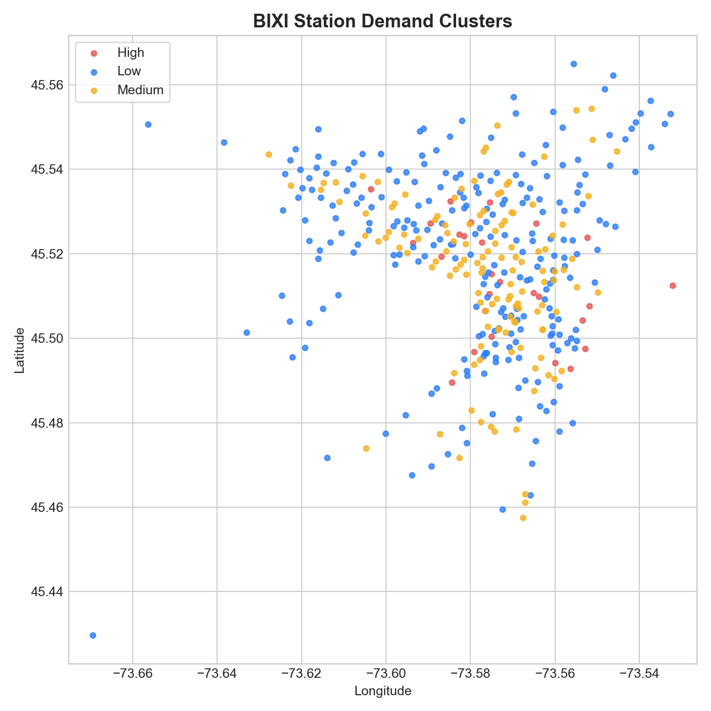

# BIXI Demand App

Streamlit dashboard for exploring and predicting BIXI station demand in Montreal using two trained ML model families and a station-clustering view.

## Project visuals
### Average hourly demand profile


### Station demand clusters


## What this project includes
- `Model 1`: demand prediction + historical demand vs. temperature chart
- `Model 2`: demand prediction with historical average demand features
- `Clusters`: station map grouped by low/medium/high average demand

## Project structure
```text
bixi-demand-app/
├── src/
│   └── app.py                         # Streamlit app entrypoint
├── models/
│   ├── model1_mlr_pipeline.pkl
│   ├── model1_rf.pkl
│   ├── model1_meta.pkl
│   ├── model2_mlr_pipeline.pkl
│   ├── model2_rf.pkl
│   └── bixi_meta.pkl
├── data/
│   ├── processed/
│   │   └── BIXI_MODEL.parquet
│   └── external/
│       ├── weatherstats_montreal_daily.csv
│       └── mtl_weather_2024.csv
├── docs/
│   └── images/
│       ├── hourly-demand-profile.png
│       └── station-demand-clusters.png
├── artifacts/
│   ├── station_clusters_model1.csv
│   └── station_clusters_model1.pkl
├── notebooks/
│   ├── BIXI_Data_Cleaning.ipynb
│   ├── BIXI_Model_1.ipynb
│   ├── BIXI_Model_2.ipynb
│   └── BIXI_Model_Clustering.ipynb
├── scripts/
│   ├── prueba.py
│   └── myclass.py
├── tests/
├── requirements.txt
├── runtime.txt
└── README.md
```

## Quick start
1. Create and activate a virtual environment.
2. Install dependencies.
3. Run Streamlit.

```bash
python -m venv .venv
source .venv/bin/activate
pip install -r requirements.txt
streamlit run src/app.py
```

## Requirements
- Python `3.12` (see `runtime.txt`)
- Packages in `requirements.txt`

## Notes on data and model files
- The app expects model files under `models/`.
- The app expects demand data under `data/processed/`.
- The station cluster view expects `artifacts/station_clusters_model1.csv`.

`src/app.py` resolves these paths from the project root, so running from different working directories is supported.

## Validation commands
Use these quick checks after changes:

```bash
python -m compileall src scripts
streamlit run src/app.py --server.headless true
```

## Dev container
`.devcontainer/devcontainer.json` is configured to open `src/app.py` and run:

```bash
streamlit run src/app.py --server.enableCORS false --server.enableXsrfProtection false
```
