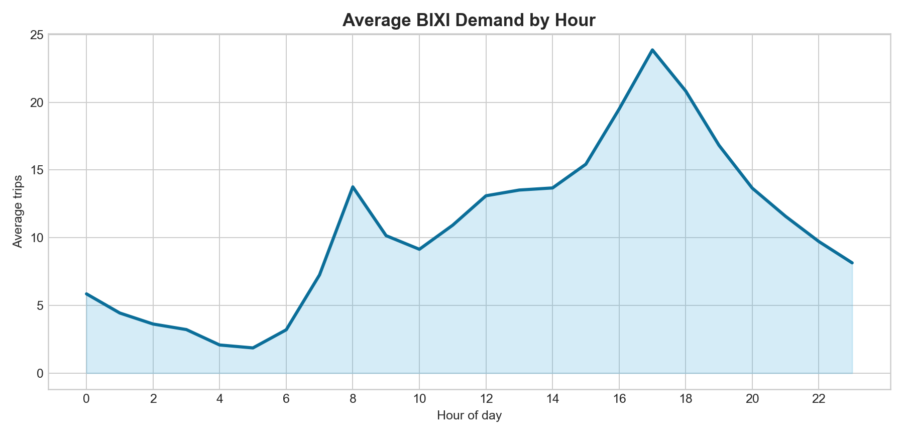
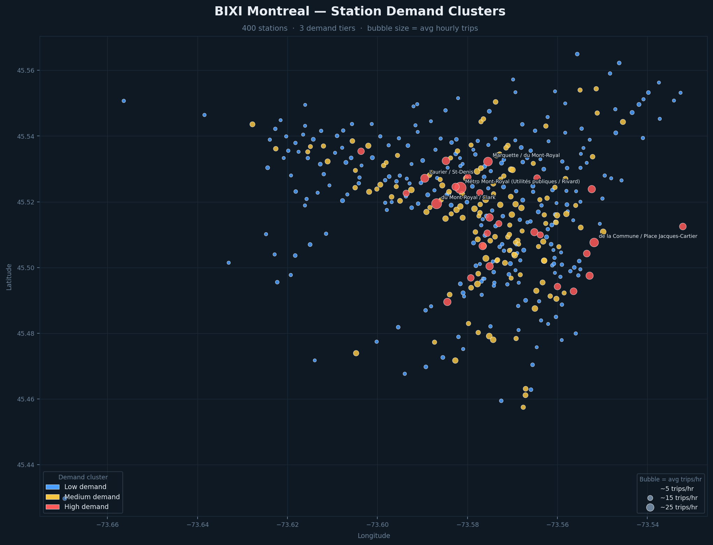

<div align="center">

# 🚲 BIXI Demand Forecasting App

**Predicting Montreal bike-share demand with machine learning**

[](https://www.python.org/)
[](https://streamlit.io/)
[](https://scikit-learn.org/)
[](LICENSE)

</div>

---

## 🗺️ Live interactive map

**[→ Open station demand map](https://YOUR_GITHUB_USERNAME.github.io/bixi-demand-app/map.html)**

Full deck.gl map with heatmap + scatter layers, hover tooltips, zoom, and 45° tilt — same rendering engine as the Streamlit app. Enable GitHub Pages from `Settings → Pages → Source: main / docs` to activate the link.

---

## What is this?

[BIXI](https://bixi.com) is Montreal's public bike-share system with hundreds of stations across the city. This project builds an **end-to-end demand analytics pipeline** — from raw trip data to an interactive Streamlit dashboard — that answers two questions:

1. **How many trips will a given station see in the next hour?** (given date, time, and weather)
2. **Which stations are high, medium, or low demand?** (geospatial clustering across the network)

---

## App overview

The dashboard has three views:

### Model 1 — Station-level prediction + demand history
- Predicts hourly trip count for a selected station, date, and hour
- Choose between a **Linear Regression pipeline** or **Random Forest**
- Plots historical temperature vs. demand for that station
- Applies seasonality guardrails (BIXI operates May through October)

### Model 2 — Prediction with historical averages
- Extends Model 1 with **station-level demand priors** (hourly and day-of-week averages)
- Better calibrated for station-specific patterns
- Same two model families available

### Clusters — Demand segmentation map
- Displays stations colored by cluster: 🔴 High / 🟡 Medium / 🔵 Low
- Interactive map powered by **pydeck**
- Cluster summary statistics by segment

---

## Visuals

### Average demand by hour of day

The data shows two clear commute peaks: a morning spike around **8 am** and an evening peak around **5 pm**, with low overnight activity.



### Station demand clusters across Montreal

High-demand stations (red) concentrate in the downtown core — Vieux-Port, Plateau, and the Lachine Canal corridor — while lower-demand blue stations spread into residential neighborhoods.

**[→ Open the interactive version](https://YOUR_GITHUB_USERNAME.github.io/bixi-demand-app/map.html)** — hover stations, scroll to zoom, right-drag to tilt.



---

## Modeling approach

### Feature engineering
| Feature type | Examples |
|---|---|
| Temporal | `hour_sin`, `hour_cos` (cyclical), `day_of_week`, `is_weekend`, `is_holiday` |
| Weather | Temperature, scaled to training distribution |
| Station | Station ID, historical demand averages (Model 2 only) |

### Models
| Model | Algorithm | Key characteristic |
|---|---|---|
| Model 1 - MLR | Linear Regression pipeline | Fast, interpretable baseline |
| Model 1 - RF | Random Forest | Captures non-linear patterns |
| Model 2 - MLR | Linear Regression + demand priors | Station-calibrated |
| Model 2 - RF | Random Forest + demand priors | Best station-specific accuracy |

### Clustering
Stations are grouped into **low / medium / high** demand categories based on historical average trip counts, precomputed and stored as `artifacts/station_clusters_model1.pkl`.

---

## Repository structure

```
bixi-demand-app/
├── src/
│   └── app.py                  # Streamlit entrypoint
├── models/                     # Trained model artifacts (.pkl)
├── artifacts/                  # Station cluster assignments
├── data/
│   ├── processed/              # Model-ready parquet dataset
│   └── external/               # Weather data (Montreal)
├── notebooks/                  # Training and analysis workflows
│   ├── BIXI_Data_Cleaning.ipynb
│   ├── BIXI_Model_1.ipynb
│   ├── BIXI_Model_2.ipynb
│   └── BIXI_Model_Clustering.ipynb
├── docs/images/                # Charts and visuals
├── requirements.txt
└── runtime.txt                 # Python 3.12
```

---

## Getting started

**Requirements:** Python 3.12

```bash
# 1. Clone the repo
git clone https://github.com/YOUR_USERNAME/bixi-demand-app.git
cd bixi-demand-app

# 2. Set up a virtual environment
python -m venv .venv
source .venv/bin/activate        # Windows: .venv\Scripts\activate

# 3. Install dependencies
pip install -r requirements.txt

# 4. Run the app
streamlit run src/app.py
```

The app resolves all data and model paths from the project root via `pathlib`, so it works regardless of your working directory.

### Dev container

A `.devcontainer` config is included for VS Code / GitHub Codespaces. It auto-opens `README.md` and `src/app.py` and launches Streamlit on startup.

---

## Tech stack

| Layer | Tools |
|---|---|
| App framework | Streamlit |
| ML / modeling | scikit-learn, pandas, numpy |
| Map visualization | pydeck |
| Data storage | Parquet (pyarrow) |
| Runtime | Python 3.12 |

---

## Known limitations & next steps

- Training is notebook-driven — no single scripted training pipeline yet
- Models are constrained to the BIXI operating season (May–October)
- No automated experiment tracking or data versioning

**Planned improvements:**
- [ ] Reproducible CLI training scripts in `src/train/`
- [ ] Automated tests for feature builders and inference shape checks
- [ ] Model performance report (metrics + error slices)
- [ ] CI pipeline for linting, tests, and app smoke checks

---

<div align="center">

Made with 🚲 and a lot of Montreal weather data

</div>
