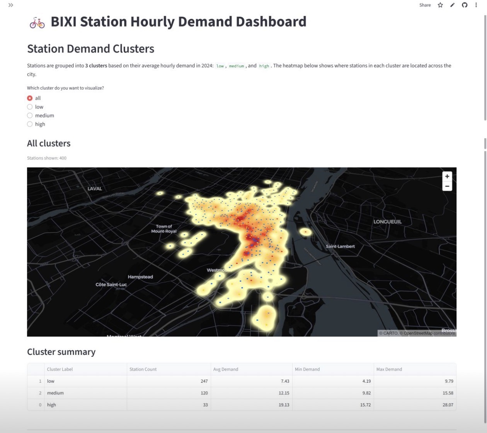
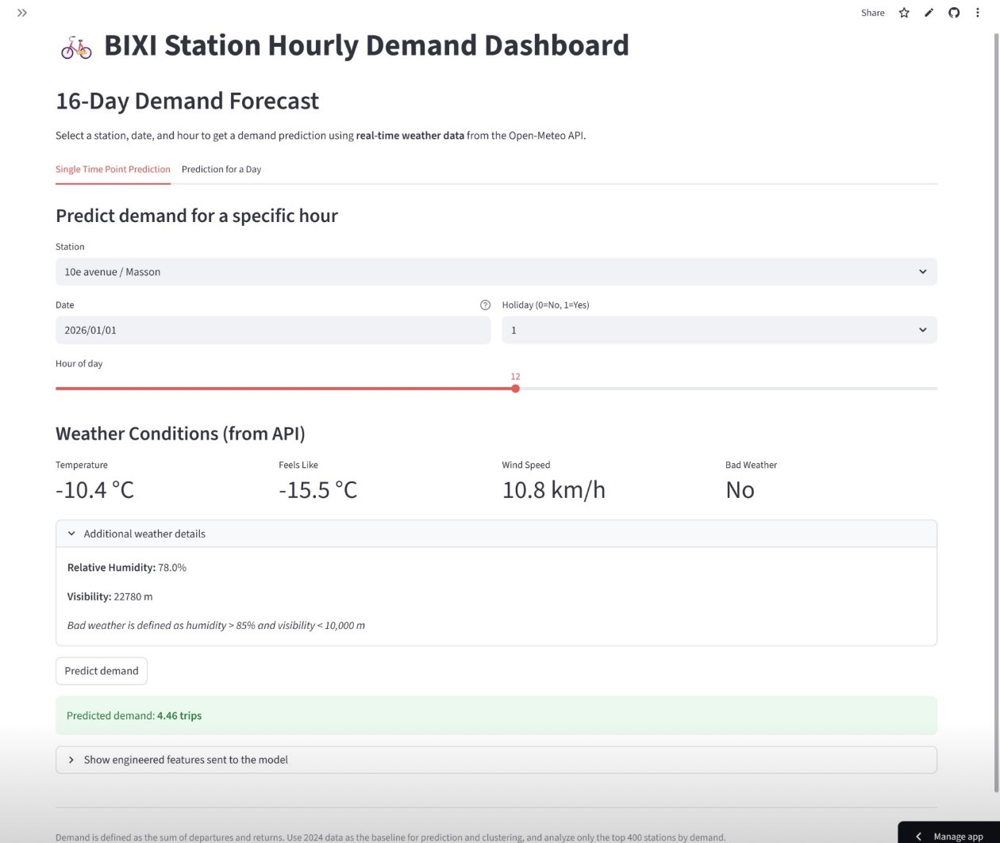
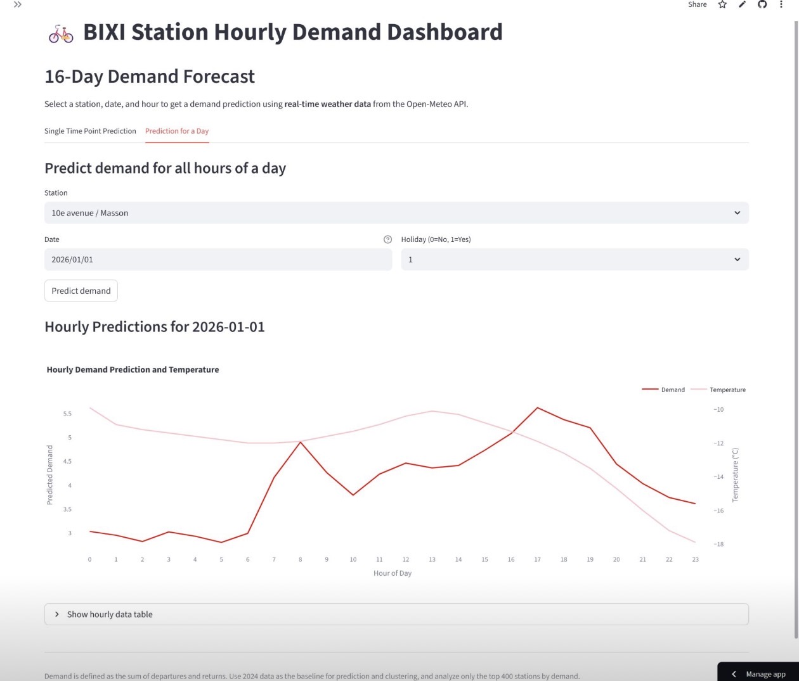
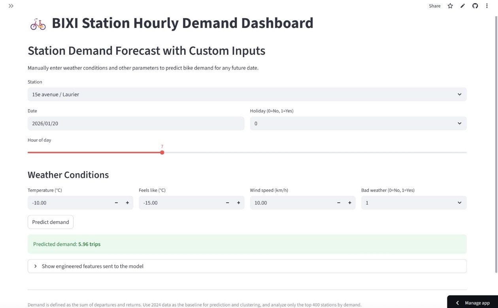

<div align="center">



# 🚲 BIXI Station Hourly Demand Dashboard

**An end-to-end machine learning project predicting bike-share demand across Montreal**

[](https://www.python.org/)
[](https://streamlit.io/)
[](https://scikit-learn.org/)
[](https://open-meteo.com/)

</div>

---

## What this project does

BIXI is Montreal's public bike-share system. This project builds a **full ML pipeline** — from 13 million raw trip records to a live interactive dashboard — that answers:

> *How many trips will a given station see in the next hour, given the date, time, and weather?*

It covers the entire data science workflow: data cleaning at scale, feature engineering, model training and comparison, station clustering, and a polished multi-view Streamlit app with real-time weather integration.

---

## The app

The dashboard has three views:

### 🗺️ Station Demand Clusters


Stations are grouped into **3 clusters** (low / medium / high) based on their average hourly demand across 2024. The pydeck heatmap shows where demand concentrates across the city — the downtown core glows red, residential neighborhoods stay cool blue.

---

### ⚡ 16-Day Demand Forecast



Select a station, date, and hour — the app fetches **real-time weather** from the Open-Meteo API and runs it through the trained Random Forest to predict demand. Temperature, feels-like, wind speed, and a bad-weather flag are all pulled live.



Switch to **Prediction for a Day** to get the full 24-hour demand curve with a dual-axis temperature overlay — useful for seeing morning and evening commute peaks at a glance.

---

### 🎛️ Custom Inputs Forecast



Manually set any weather scenario and run predictions with either the MLR pipeline or Random Forest. Good for exploring what-if conditions: *What happens to demand at Berri-UQAM on a hot Friday evening vs. a rainy Tuesday morning?*

---

## How it was built

### 1. Data pipeline

Starting from raw BIXI open data for the full 2024 season (May–October):

- **13.2 million trip records** cleaned: nulls dropped, duration outliers removed (z-score), trips filtered to the top 400 stations by total demand
- **Montreal hourly weather data** merged on datetime: temperature, wind speed, relative humidity, visibility
- `bad_weather` engineered as `humidity > 85% AND visibility < 10,000 m`
- Final model dataset: hourly demand per station, joined with weather and station coordinates

### 2. Feature engineering

| Feature | Description |
|---|---|
| `hour_sin`, `hour_cos` | Cyclical hour encoding (no ordinal gap between 23→0) |
| `is_weekend`, `is_holiday` | Binary flags |
| `bad_weather` | Humidity + visibility threshold |
| `temperature_scaled` | Z-score normalised |
| `temp_hour`, `temperature_sq` | Interaction + non-linear weather terms |
| `hour_bucket` | night / morning / day / evening / late |
| `avg_hourly_demand_station` | Station-level historical prior (Model 2 only) |
| `avg_dayofweek_station` | Day-of-week prior (Model 2 only) |

### 3. Models

Two families, each trained with and without station historical priors:

| | Model 1 | Model 2 |
|---|---|---|
| **Features** | Temporal + weather + station | Model 1 + historical demand averages |
| **MLR** | Scikit-learn pipeline with OHE | Same + demand priors |
| **Random Forest** | Station-encoded, full feature set | Best station-specific accuracy |

### 4. Clustering

KMeans (k=3) on station average demand → **low / medium / high** labels used for the heatmap view.

| Cluster | Stations | Avg demand | Range |
|---|---|---|---|
| Low | 247 | 7.4 trips/hr | 4.2 – 9.8 |
| Medium | 120 | 12.2 trips/hr | 9.8 – 15.6 |
| High | 33 | 19.1 trips/hr | 15.7 – 28.1 |

---

## Getting started

```bash
git clone https://github.com/YOUR_USERNAME/bixi-demand-app.git
cd bixi-demand-app

python -m venv .venv
source .venv/bin/activate   # Windows: .venv\Scripts\activate
pip install -r requirements.txt

streamlit run src/app.py
```

> Python 3.12 required. See `runtime.txt`.

A `.devcontainer` config is included for VS Code / GitHub Codespaces — opens directly with Streamlit running.

---

## Repository structure

```
bixi-demand-app/
├── src/app.py                  # Streamlit dashboard (all views)
├── models/                     # Trained model artifacts (.pkl)
├── artifacts/                  # Station cluster assignments
├── data/
│   ├── processed/              # BIXI_MODEL.parquet (model-ready dataset)
│   └── external/               # Montreal weather CSVs
├── notebooks/
│   ├── BIXI_Data_Cleaning.ipynb
│   ├── BIXI_Model_1.ipynb
│   ├── BIXI_Model_2.ipynb
│   └── BIXI_Model_Clustering.ipynb
├── docs/images/                # App screenshots & visuals
└── requirements.txt
```

---

## Tech stack

`Python 3.12` · `Streamlit` · `scikit-learn` · `pandas` · `pydeck` · `Open-Meteo API` · `pyarrow`

---

<div align="center">

Made with 🚲 and a lot of Montreal weather data

</div>
